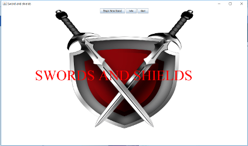
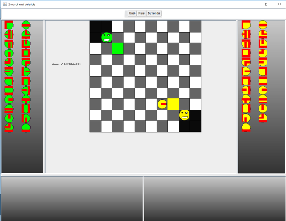
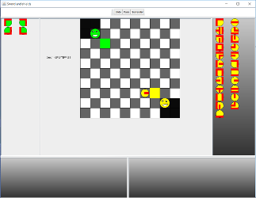
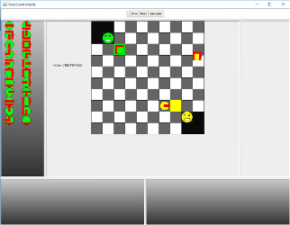

#Swords And Shields

## Description
This game was created for a university assignment for learning how to construct GUI's and the use of design patterns such as Model View Controller. The games object is to have a sword to the players face (the smiley faces). The pieces sides have three possible elements being sword, shield or nothing. Pieces next to each other have certain reactions such as sword to a shield will push the piece with a sword and a sword to nothing will remove the piece with nothing. The piece once selected will allow the user to selected the rotation of the piece and the piece will move between panes once selected.

## Installation
The game can be run with the use of `java -jar SwordsAndShields.jar`.